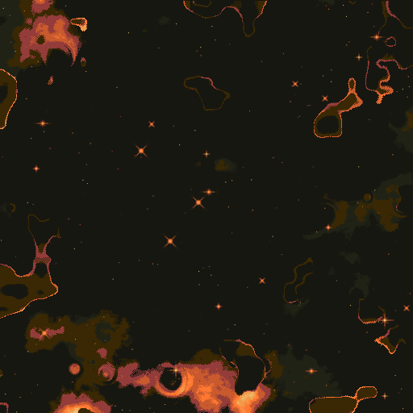

# Pixel Space Backgrounds (Godot 4.7)

Create procedural pixel-art space backgrounds for your games — and export
them as parallax-ready layers.

## Features

- **Procedural generation** — shader-driven nebulae, star dust, bright stars
  and planets over 13 built-in color schemes
- **Seed control** — every image shows its seed; lock it to replay an exact
  image, or type a seed to revisit it later
- **Generation sliders** — planet count, star density, dust and nebula scale
  (or leave Auto counts on for the classic random mix)
- **Resolution presets** — HD through 4K, phone portrait, squares, custom
  up to 5000px on desktop (2048px cap on mobile/web for performance)
- **Export** — PNG/JPG/WebP, batch-export N variations, and **per-layer
  export** (`background`, `nebulae`, `dust`, `stars`, `planets` PNGs with
  alpha) for parallax scrolling
- **Responsive UI** — portrait phones stack the preview over a scrollable
  settings panel; the render viewport sleeps when idle to save battery

## Running from source

Requires Godot 4.7. Open `project.godot` and press Run (main scene:
`GUI/GUI.tscn`).

## Exporting builds

1. Install the 4.7 export templates (Editor → Manage Export Templates).
2. `cp export_presets.cfg.example export_presets.cfg`, open Project →
   Export once to normalize, and set your Android keystore for releases.
3. `godot --headless --export-release "<Preset>" ../dist/...`
   (Presets: Linux, Windows, Android, Web.)

Desktop saves go to the OS Pictures folder (shown in the UI); the web
build downloads the file instead.

## Tests & CI

- `tests/parity_capture.gd` — deterministic harness: reseeds the RNG,
  captures the viewport and prints a SHA256 of the raw pixels. Run the same
  seed/size on two builds and diff `PARITY_HASH` (needs a real renderer,
  e.g. `--display-driver wayland --rendering-driver vulkan`).
- `.github/workflows/godot-checks.yml` runs headless import, per-script
  syntax checks and a scene smoke run on every push/PR.

## History

Fork of the classic Godot space-background generator, modernized:

1. Ported to Godot 4 (4.3, then 4.7 + Mobile renderer)
2. Statically typed GDScript throughout
3. Max resolution 5k × 5k (drops frames on low-end devices at that size)
4. Android build for making wallpapers; touch-friendly UI
5. Pictures folder as default save location, shown in the UI
6. On-demand viewport rendering (UPDATE_ONCE) for idle battery savings

## License

Code is MIT licensed. Generated images are free to use in games and other
projects — just don't distribute or sell the generated images on their own.
